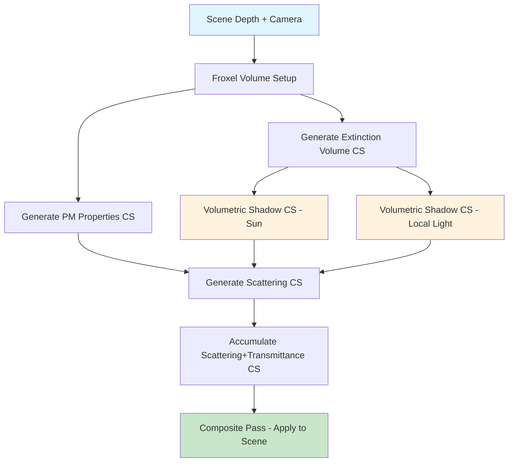

# Action Week Plan: Simplified Volumetric Rendering with Shadows Prototype

| Field | Value |
|-------|-------|
| **Author** | Aik Keawcharoen |
| **Duration** | 1 Week (5 working days) |
| **Goal** | Prototype a simplified version of Frostbite's volumetric rendering pipeline including volumetric shadows |
| **Output** | Standalone compute-shader-based volumetric fog + shadow prototype demonstrating core algorithms |

---

## 1. Objective

Build a minimal, self-contained prototype that demonstrates the core principles of Frostbite's volumetric rendering pipeline:

1. **Froxel-based camera volume** — a frustum-aligned 3D texture (view-space voxel grid)
2. **Participating media evaluation** — scattering, extinction, and phase function per froxel
3. **Volumetric shadow maps** — per-light transmittance computed by ray-marching through extinction volumes
4. **In-scattering accumulation** — front-to-back integration with analytical transmittance
5. **Final compositing** — applying volumetric fog to the scene during the resolve pass

---

## 2. Reference Architecture (Frostbite Production)

Based on codebase analysis, Frostbite's volumetric system consists of:

| Stage | Shader / Module | Purpose |
|-------|----------------|---------|
| Extinction Generation | `GenerateExtinctionVolumeCS.hlsl` | Rasterize PM volumes into cascaded extinction 3D textures |
| PM Properties | `GenerateParticipatingMediaPropertiesCameraVolumeCS.hlsl` | Evaluate scattering/extinction/emissive/phase per camera froxel |
| Volumetric Shadows | `VolumetricShadowCS.hlsl` | Ray-march extinction volume toward each light to compute transmittance |
| In-Scattering | `GenerateScatteringExtinctionCameraVolumeCS.hlsl` | Evaluate lighting per froxel (sun + local lights, using shadow maps + volumetric shadow + light culling) |
| Accumulation | `AccumScatteringTransmittanceCameraVolumeCS.hlsl` | Front-to-back integration of scattered light and transmittance |
| Temporal AA | `VolumetricTAA.hlsl` | Temporal reprojection/filtering |
| Particle Voxelization | `VoxelizeParticlesCS.hlsl` | Inject particle density into froxels |
| Debug | `VolumetricDataDebug.hlsl` | Debug visualization |

**Key data structures:**
- `ParticipatingMediaSimple` — `{float3 scattering, float extinction, float3 emissive, float phase}`
- `CommonParticipatingMediaConstants` — per-frame constants (volume dims, camera pos, depth distribution)
- `CascadedVolumes` — multi-resolution extinction volumes snapped to voxel grid
- `ParticipatingMediaVolumeGpuData` — per-volume GPU representation (transform, optical properties)

---

## 3. Simplified Prototype Scope

### In Scope
- Single-cascade froxel volume (no multi-cascade complexity)
- Homogeneous + one box-shaped fog volume
- Directional light (sun) with volumetric shadow
- One point/spot light with volumetric shadow
- Henyey-Greenstein phase function
- Analytical front-to-back accumulation (Beer's law integration)
- Exponential depth-slice distribution
- Basic temporal jittering (no full TAA)

### Out of Scope
- Multi-cascade extinction volumes
- Expression-shader-based PM graph evaluation
- Particle voxelization
- GI probe integration
- Cloud shadows
- Full temporal anti-aliasing with reprojection
- Terrain heightfield sampling
- Wind vector fields

---

## 4. Daily Breakdown

### Day 1: Foundation & Froxel Volume Setup

**Goal:** Set up project scaffolding and create the camera-aligned froxel (frustum voxel) volume.

**Tasks:**
- [ ] Set up standalone rendering project (or extend existing test framework)
- [ ] Create 3D render target for the camera volume (e.g., 160×90×64 RGBA16F)
- [ ] Implement depth-slice distribution (exponential mapping from Frostbite):
  ```
  // Exponential depth distribution from VolumetricCommon.hlsl
  depth = (pow(k+1, normalizedSlice) - 1) / k
  ```
- [ ] Write UV-to-world-position reconstruction for froxel centers
- [ ] Implement `CommonParticipatingMediaConstants` constant buffer
- [ ] Validate with a debug visualization pass (render froxel grid as colored slices)

**Key Reference:**
- `VolumetricCommon.hlsl` — depth distribution functions (`linearToExponentialDistribution`)
- `VolumetricRenderModule.h` — `ParticipatingMediaPerFrameConstants` struct

**Deliverable:** Froxel volume with correct world-space reconstruction, visible in debug view.

---

### Day 2: Participating Media & Extinction Volume

**Goal:** Fill froxels with participating media properties and generate the extinction volume.

**Tasks:**
- [ ] Define `ParticipatingMediaSimple` struct in shader:
  ```hlsl
  struct ParticipatingMediaSimple {
      float3 scattering;  // scattering coefficient (1/m)
      float  extinction;  // extinction coefficient (1/m)
      float3 emissive;    // emission (luminance/m)
      float  phase;       // HG phase function g parameter
  };
  ```
- [ ] Implement global homogeneous fog (height-based exponential density)
- [ ] Implement one analytical box volume (OBB) with falloff:
  - Transform world position into volume local space
  - Apply edge fade (linear or smooth)
  - Composite scattering/extinction from volume onto global
- [ ] Write `GenerateExtinctionVolumeCS` — fills a 3D texture with extinction only
- [ ] Write `GeneratePMPropertiesCS` — fills camera volume with full PM properties per froxel

**Key Reference:**
- `ParticipatingMediaVolumeGpuData` in `VolumetricRenderModule.h` — volume GPU layout
- `VolumetricCommon.hlsl` — `ParticipatingMediaSimple`, optical depth, transmittance helpers

**Deliverable:** 3D textures populated with extinction and PM properties; debug vis showing density.

---

### Day 3: Volumetric Shadow Maps

**Goal:** Compute per-light volumetric shadow transmittance by ray-marching through the extinction volume.

**Tasks:**
- [ ] Implement sun volumetric shadow compute shader:
  - For each voxel in a light-aligned 3D shadow volume, ray-march from voxel toward light
  - Sample extinction volume at each step
  - Accumulate optical depth → compute transmittance via Beer's law
  ```hlsl
  // From VolumetricShadowCS.hlsl pattern
  float3 transmittance = 1.0;
  for (float t = 0.0; t < 1.0; t += sampleCountInv) {
      float3 extinction = extinctionVolume.SampleLevel(sampler, uvw, 0);
      float3 opticalThickness = extinction * stepLength;
      transmittance *= exp(-opticalThickness);
  }
  ```
- [ ] Implement local light (point/spot) volumetric shadow:
  - Spherical shadow volume centered on light
  - Ray-march from voxel toward light position
  - Store transmittance in per-light shadow texture slice
- [ ] Handle cascade blending for extinction sampling (simplified: single cascade)
- [ ] Bind shadow volume texture(s) for use in lighting pass

**Key Reference:**
- `VolumetricShadowCS.hlsl` — `getTransmittance()` function, ray-march loop, extinction cascade sampling

**Deliverable:** Volumetric shadow maps for sun + one local light; debug visualization of shadow volumes.

---

### Day 4: In-Scattering & Light Accumulation

**Goal:** Evaluate lighting per froxel and accumulate scattered light front-to-back.

**Tasks:**
- [ ] Implement Henyey-Greenstein phase function:
  ```hlsl
  float hgPhase(float cosTheta, float g) {
      float g2 = g * g;
      float denom = 1.0 + g2 - 2.0 * g * cosTheta;
      return (1.0 - g2) / (4.0 * PI * pow(denom, 1.5));
  }
  ```
- [ ] Write `GenerateScatteringCS` — per-froxel lighting evaluation:
  - Sun contribution: `sunColor * sunVisibility * volumetricShadow * phase * scattering`
  - Local light contribution: attenuation × volumetric shadow × phase × scattering
  - Ambient/emissive term
- [ ] Write `AccumScatteringTransmittanceCS` — front-to-back integration:
  ```hlsl
  // Analytical integration (from Frostbite AccumScatteringTransmittanceCameraVolumeCS.hlsl)
  float a = max(extinction, 0.000001);
  float3 b = scatteredLight;
  float transmittance = exp(-a * stepLen);
  float3 integralScattered = (b - b * transmittance) / a;
  
  accumScattering += accumTransmittance * integralScattered;
  accumTransmittance *= transmittance;
  ```
- [ ] Output: `float3 inScattering` + `float transmittance` per froxel (accumulated)

**Key Reference:**
- `GenerateScatteringExtinctionCameraVolumeCS.hlsl` — full lighting evaluation per froxel
- `AccumScatteringTransmittanceCameraVolumeCS.hlsl` — front-to-back accumulation with analytical integration

**Deliverable:** Accumulated scattering + transmittance volume; visible volumetric lighting in debug view.

---

### Day 5: Compositing, Polish & Documentation

**Goal:** Apply volumetric fog to the final image, add temporal jitter, polish and document.

**Tasks:**
- [ ] Write compositing pass (full-screen pixel shader):
  ```hlsl
  // Sample accumulated volume at pixel's depth
  float3 uvw = float3(screenUV, depthToSlice(linearDepth));
  float3 inScattering = volumeScattering.Sample(sampler, uvw);
  float  transmittance = volumeTransmittance.Sample(sampler, uvw);
  
  // Apply to scene
  finalColor = sceneColor * transmittance + inScattering;
  ```
- [ ] Add temporal jittering:
  - Per-frame random offset to ray-march start position (Van der Corput sequence)
  - Reduces banding artifacts at low sample counts
- [ ] Implement basic temporal filtering (exponential moving average with previous frame):
  ```hlsl
  float3 current = currentScattering;
  float3 history = historyVolume.Sample(sampler, reprojectedUVW);
  float3 result = lerp(history, current, 0.05); // 95% history blend
  ```
- [ ] Performance profiling and optimization notes
- [ ] Write-up: document shader pipeline, data flow diagram, parameters exposed
- [ ] Record comparison screenshots/video (with/without volumetrics, with/without shadows)

**Deliverable:** Complete prototype with scene compositing, documented results, and performance notes.

---

## 5. Data Flow Diagram



---

## 6. Resource Requirements

| Resource | Format | Resolution | Purpose |
|----------|--------|------------|---------|
| Extinction Volume | R16F or R11G11B10F | 160×90×64 | Extinction coefficient per froxel |
| Scattering Volume | RGBA16F | 160×90×64 | Scattered light (RGB) per froxel |
| Transmittance Volume | R16F | 160×90×64 | Accumulated transmittance per froxel |
| Sun Shadow Volume | R11G11B10F | 64×64×64 | Volumetric shadow (transmittance toward sun) |
| Local Light Shadow | R11G11B10F | 32×32×32 | Volumetric shadow (transmittance toward light) |
| PM Properties Volume | RGBA16F | 160×90×64 | Scattering + extinction per froxel |
| History Buffer | RGBA16F | 160×90×64 | Previous frame for temporal filtering |

**Estimated GPU memory:** ~50-80 MB (prototype quality)

---

## 7. Key Algorithms Summary

### Depth Slice Distribution (Exponential)
```
// Map linear [0,1] to exponential depth
depth(t) = (pow(k+1, t) - 1) / k

// Inverse (depth to slice)
slice(d) = log2(k*d + 1) / log2(k+1)
```
Where `k` controls the exponential curve (higher = more near-field precision).

### Beer's Law Transmittance
```
T(d) = exp(-σ_t * d)
```
Where `σ_t` is extinction coefficient, `d` is distance.

### Analytical In-Scattering Integration
```
// For a froxel with constant scattering S and extinction σ over step Δ:
T_step = exp(-σ * Δ)
L_step = S * (1 - T_step) / σ

// Accumulate front-to-back:
L_accum += T_accum * L_step
T_accum *= T_step
```

### Henyey-Greenstein Phase Function
```
p(θ, g) = (1 - g²) / (4π * (1 + g² - 2g*cos(θ))^1.5)
```

---

## 8. Success Criteria

- [ ] Visible volumetric fog with correct depth-dependent density
- [ ] Sun light shafts (god rays) from volumetric shadow
- [ ] Local light correctly illuminates fog volume with attenuation + shadow
- [ ] Correct front-to-back accumulation (no energy gain, physically plausible)
- [ ] Shadows in fog match expected light occlusion from extinction
- [ ] Performance target: < 2ms GPU at 1080p on mid-range GPU
- [ ] Clear documentation of pipeline for future integration reference

---

## 9. Risks & Mitigations

| Risk | Likelihood | Mitigation |
|------|-----------|------------|
| Banding artifacts from low sample count | High | Temporal jitter + dithering + TAA integration |
| Light leaking through thin geometry | Medium | Use scene shadow maps as additional occlusion term |
| Performance exceeds budget on Day 3-4 | Medium | Reduce volume resolution (120×68×48), reduce shadow ray samples |
| Incorrect depth reconstruction | Low | Validate with debug views on Day 1, unit test depth mapping |
| Temporal ghosting from simple EMA filter | Medium | Acceptable for prototype; document as future work |

---

## 10. References

- Frostbite `Code/Engine/Volumetric/` — Production volumetric system
- `VolumetricCommon.hlsl` — Core participating media math
- `VolumetricShadowCS.hlsl` — Shadow ray-march implementation
- `AccumScatteringTransmittanceCameraVolumeCS.hlsl` — Analytical integration
- `GenerateScatteringExtinctionCameraVolumeCS.hlsl` — Per-froxel lighting
- Hillaire, "Physically Based Sky, Atmosphere, and Cloud Rendering in Frostbite" (SIGGRAPH 2016)
- Wronski, "Volumetric Fog: Unified Compute Shader Based Solution" (SIGGRAPH 2014)
