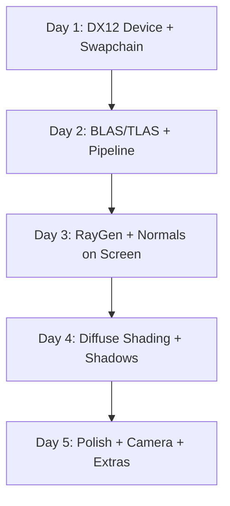

# Action Week Plan: Hardware Ray Tracing Toy Renderer Prototype

**Author:** [Your Name]  
**Date:** 2026-06-15  
**Duration:** 5 days (Action Week)  
**Platform:** PC (DX12 with DXR 1.1 — RTX 2000+ / RDNA2+)  
**Prerequisites:** RTX/RDNA2-capable GPU, Windows 10 20H2+, Visual Studio 2022, Windows SDK 10.0.20348+, DXC compiler

---

## 1. Goal

Build a **minimal, self-contained hardware ray tracing renderer** in your toy renderer that demonstrates the full DXR pipeline from scratch: window → device → acceleration structures → ray dispatch → shading → present. No engine dependencies — pure Win32 + DX12 + DXR.

**Success Criteria:**
- Standalone executable that opens a window and ray traces a scene
- Hard-coded Cornell box geometry — no asset loading required
- Primary rays with diffuse shading + hard shadow rays
- Clean render loop: build AS → bind → dispatch → copy to backbuffer → present
- Code is self-contained, well-commented, and easy to follow

---

## 2. Architecture Overview



### DX12 / DXR Concepts Used

| Concept | DX12 API | Role |
|---------|----------|------|
| **Device** | `ID3D12Device5` | DXR-capable device (minimum) |
| **Command Queue/List** | `ID3D12GraphicsCommandList4` | Records RT commands |
| **BLAS** | `BuildRaytracingAccelerationStructure` | Per-mesh geometry AS |
| **TLAS** | `BuildRaytracingAccelerationStructure` | Scene-level instance AS |
| **RT Pipeline (RTPSO)** | `ID3D12StateObject` | Ray generation + hit + miss shaders |
| **Shader Binding Table** | GPU buffer with shader records | Maps rays to shader invocations |
| **DispatchRays** | `DispatchRays()` | Launches rays from the GPU |
| **Root Signature** | Global + local root signatures | Resource binding for RT shaders |

---

## 3. Daily Breakdown

### Day 1 — Foundation: DX12 Device, Swapchain & Resource Helpers

**Objective:** Get a window with a DX12 swapchain showing a cleared color. Set up the minimal infrastructure for RT.

**Tasks:**
- [ ] Create Win32 window (or reuse your toy renderer's window)
- [ ] Initialize DX12:
  - `IDXGIFactory6` → enumerate adapters
  - `D3D12CreateDevice` with feature level 12_1
  - Verify DXR support:
    ```cpp
    D3D12_FEATURE_DATA_D3D12_OPTIONS5 opts5 = {};
    device->CheckFeatureSupport(D3D12_FEATURE_D3D12_OPTIONS5, &opts5, sizeof(opts5));
    assert(opts5.RaytracingTier >= D3D12_RAYTRACING_TIER_1_1);
    ```
  - Create command queue, command allocator, command list (`ID3D12GraphicsCommandList4`)
  - Create swapchain (2-3 backbuffers, `DXGI_FORMAT_R8G8B8A8_UNORM`)
  - Create fence for frame synchronization
- [ ] Create a UAV texture (ray tracing output target):
  ```cpp
  D3D12_RESOURCE_DESC uavDesc = {};
  uavDesc.Dimension = D3D12_RESOURCE_DIMENSION_TEXTURE2D;
  uavDesc.Width = windowWidth;
  uavDesc.Height = windowHeight;
  uavDesc.Format = DXGI_FORMAT_R8G8B8A8_UNORM;
  uavDesc.Flags = D3D12_RESOURCE_FLAG_ALLOW_UNORDERED_ACCESS;
  ```
- [ ] Create descriptor heaps (CBV/SRV/UAV)
- [ ] Implement frame loop: clear → present

**Deliverable:** Window with cleared swapchain. DXR tier confirmed.

---

### Day 2 — Acceleration Structures + RT Pipeline State Object

**Objective:** Build BLAS/TLAS for a hardcoded scene and create the RT pipeline with raygen/miss/hit shaders.

**Tasks:**
- [ ] Define Cornell box geometry in code (~30 triangles):
  ```cpp
  struct Vertex { float pos[3]; float normal[3]; };
  // Floor, ceiling, back wall, left wall (red), right wall (green), 2 boxes
  ```
- [ ] Upload vertex/index buffers to GPU (default heap)
- [ ] Build BLAS:
  ```cpp
  D3D12_RAYTRACING_GEOMETRY_DESC geomDesc = {};
  geomDesc.Type = D3D12_RAYTRACING_GEOMETRY_TYPE_TRIANGLES;
  geomDesc.Triangles.VertexBuffer.StartAddress = vbGpuAddr;
  geomDesc.Triangles.VertexBuffer.StrideInBytes = sizeof(Vertex);
  geomDesc.Triangles.VertexCount = vertexCount;
  geomDesc.Triangles.VertexFormat = DXGI_FORMAT_R32G32B32_FLOAT;
  geomDesc.Triangles.IndexBuffer = ibGpuAddr;
  geomDesc.Triangles.IndexCount = indexCount;
  geomDesc.Triangles.IndexFormat = DXGI_FORMAT_R16_UINT;
  geomDesc.Flags = D3D12_RAYTRACING_GEOMETRY_FLAG_OPAQUE;

  D3D12_BUILD_RAYTRACING_ACCELERATION_STRUCTURE_INPUTS blasInputs = {};
  blasInputs.Type = D3D12_RAYTRACING_ACCELERATION_STRUCTURE_TYPE_BOTTOM_LEVEL;
  blasInputs.Flags = D3D12_RAYTRACING_ACCELERATION_STRUCTURE_BUILD_FLAG_PREFER_FAST_TRACE;
  blasInputs.NumDescs = 1;
  blasInputs.pGeometryDescs = &geomDesc;

  // Query prebuild info for buffer sizes
  device->GetRaytracingAccelerationStructurePrebuildInfo(&blasInputs, &prebuildInfo);
  // Allocate scratch + result buffers, then:
  cmdList->BuildRaytracingAccelerationStructure(&blasBuildDesc, 0, nullptr);
  ```
- [ ] Build TLAS from BLAS instances:
  ```cpp
  D3D12_RAYTRACING_INSTANCE_DESC instanceDesc = {};
  // Set 3x4 transform matrix (row-major)
  instanceDesc.InstanceMask = 0xFF;
  instanceDesc.AccelerationStructure = blasResultBuffer->GetGPUVirtualAddress();
  ```
- [ ] Author HLSL shaders (single file or split):
  - `RayGen` — generate camera rays, write to UAV
  - `Miss` — sky gradient
  - `ClosestHit` — output normal as color (for now)
- [ ] Compile shaders with DXC (`dxc -T lib_6_3`)
- [ ] Create RT Pipeline State Object (`ID3D12StateObject`):
  ```cpp
  CD3DX12_STATE_OBJECT_DESC rtpsoDesc(D3D12_STATE_OBJECT_TYPE_RAYTRACING_PIPELINE);
  // Add DXIL library subobject
  // Add hit group subobject (ClosestHit)
  // Add shader config (payload + attribute size)
  // Add local/global root signature
  // Add pipeline config (max recursion = 1)
  ```
- [ ] Create global root signature (TLAS SRV + output UAV + scene constants CBV)

**Deliverable:** BLAS + TLAS built. RTPSO compiles without errors.

---

### Day 3 — Shader Binding Table + DispatchRays + First Image

**Objective:** Wire everything together and get the first ray-traced image on screen.

**Tasks:**
- [ ] Build Shader Binding Table (SBT):
  ```cpp
  // SBT layout:
  // [RayGen record]  — shader identifier (32 bytes) + local root args
  // [Miss record]    — shader identifier
  // [HitGroup record] — shader identifier + local root args (per-geometry data)

  void* rayGenId = stateObjectProps->GetShaderIdentifier(L"RayGen");
  void* missId   = stateObjectProps->GetShaderIdentifier(L"Miss");
  void* hitId    = stateObjectProps->GetShaderIdentifier(L"HitGroup");
  // Copy into GPU buffer with D3D12_RAYTRACING_SHADER_TABLE_BYTE_ALIGNMENT
  ```
- [ ] Set up `D3D12_DISPATCH_RAYS_DESC`:
  ```cpp
  D3D12_DISPATCH_RAYS_DESC dispatchDesc = {};
  dispatchDesc.RayGenerationShaderRecord.StartAddress = sbtGpuAddr;
  dispatchDesc.RayGenerationShaderRecord.SizeInBytes = rayGenRecordSize;
  dispatchDesc.MissShaderTable.StartAddress = missTableAddr;
  dispatchDesc.MissShaderTable.SizeInBytes = missRecordSize;
  dispatchDesc.MissShaderTable.StrideInBytes = missRecordSize;
  dispatchDesc.HitGroupTable.StartAddress = hitTableAddr;
  dispatchDesc.HitGroupTable.SizeInBytes = hitRecordSize;
  dispatchDesc.HitGroupTable.StrideInBytes = hitRecordSize;
  dispatchDesc.Width = windowWidth;
  dispatchDesc.Height = windowHeight;
  dispatchDesc.Depth = 1;

  cmdList->SetPipelineState1(rtpso);
  cmdList->DispatchRays(&dispatchDesc);
  ```
- [ ] Copy UAV output → backbuffer (`CopyResource`)
- [ ] Add scene constants buffer (camera inverse view/proj matrices):
  ```cpp
  struct SceneConstants {
      XMFLOAT4X4 viewInverse;
      XMFLOAT4X4 projInverse;
  };
  ```
- [ ] Implement camera ray generation in RayGen shader:
  ```hlsl
  [shader("raygeneration")]
  void RayGen() {
      uint2 launchIndex = DispatchRaysIndex().xy;
      float2 dims = float2(DispatchRaysDimensions().xy);
      float2 uv = (launchIndex + 0.5) / dims * 2.0 - 1.0;

      float4 origin = mul(viewInverse, float4(0, 0, 0, 1));
      float4 target = mul(projInverse, float4(uv.x, -uv.y, 1, 1));
      float4 direction = mul(viewInverse, float4(normalize(target.xyz), 0));

      RayDesc ray;
      ray.Origin = origin.xyz;
      ray.Direction = direction.xyz;
      ray.TMin = 0.001;
      ray.TMax = 10000.0;

      HitPayload payload = { float3(0, 0, 0) };
      TraceRay(gScene, RAY_FLAG_NONE, 0xFF, 0, 0, 0, ray, payload);
      gOutput[launchIndex] = float4(payload.color, 1);
  }
  ```
- [ ] Present backbuffer

**Deliverable:** First ray-traced image on screen (normals or flat color on hit, sky on miss).

---

### Day 4 — Diffuse Shading + Shadow Rays

**Objective:** Add proper lighting with Lambertian shading and hard shadow rays.

**Tasks:**
- [ ] Update scene constants with light info:
  ```cpp
  struct SceneConstants {
      XMFLOAT4X4 viewInverse;
      XMFLOAT4X4 projInverse;
      XMFLOAT4   lightPosition;   // point light at ceiling
      XMFLOAT4   lightColor;
      XMFLOAT4   ambientColor;
  };
  ```
- [ ] Update ClosestHit shader for diffuse + shadow:
  ```hlsl
  [shader("closesthit")]
  void ClosestHit(inout HitPayload payload, in BuiltInTriangleIntersectionAttributes attr) {
      // Reconstruct hit position
      float3 hitPos = WorldRayOrigin() + RayTCurrent() * WorldRayDirection();

      // Get face normal (from vertex data or cross product)
      float3 normal = getNormal(PrimitiveIndex(), attr.barycentrics);

      // Shadow ray toward light
      float3 toLight = normalize(lightPos.xyz - hitPos);
      RayDesc shadowRay;
      shadowRay.Origin = hitPos + normal * 0.001;
      shadowRay.Direction = toLight;
      shadowRay.TMin = 0.001;
      shadowRay.TMax = length(lightPos.xyz - hitPos);

      ShadowPayload shadowPayload = { false };
      TraceRay(gScene,
          RAY_FLAG_ACCEPT_FIRST_HIT_AND_END_SEARCH | RAY_FLAG_SKIP_CLOSEST_HIT_SHADER,
          0xFF, 0, 0, 1, shadowRay, shadowPayload);

      float shadow = shadowPayload.isHit ? 0.2 : 1.0;
      float NdotL = max(0, dot(normal, toLight));
      payload.color = albedo * (ambient + shadow * NdotL * lightColor);
  }
  ```
- [ ] Add second miss shader for shadow rays:
  ```hlsl
  [shader("miss")]
  void ShadowMiss(inout ShadowPayload payload) {
      payload.isHit = false; // light is reachable
  }
  ```
- [ ] Update pipeline config: `MaxTraceRecursionDepth = 2`
- [ ] Update SBT with second miss entry
- [ ] Add per-geometry color data (red wall, green wall, white floor/ceiling):
  - Option A: Local root signature with per-hitgroup constant
  - Option B: Structured buffer indexed by `InstanceID()` or `GeometryIndex()`
- [ ] Bind vertex/index buffer as SRV so ClosestHit can read normals

**Deliverable:** Lit Cornell box with colored walls and hard shadows from a point light.

---

### Day 5 — Polish: Camera Controls, Debug Modes & Documentation

**Objective:** Make the prototype interactive and well-documented.

**Tasks:**
- [ ] Add simple orbit camera (mouse drag to rotate, scroll to zoom):
  ```cpp
  // Update viewInverse/projInverse each frame based on input
  float azimuth += dx * sensitivity;
  float elevation += dy * sensitivity;
  ```
- [ ] Add keyboard toggles for debug views:
  - `1` — Final shaded output
  - `2` — Normals visualization
  - `3` — Shadow mask only (black/white)
  - `4` — Depth (TMax) visualization
  - `5` — Barycentrics
- [ ] Add frame accumulation for smoother output (optional):
  ```hlsl
  float3 prev = gAccumulation[launchIndex].rgb;
  float3 blended = lerp(prev, payload.color, 1.0 / (frameCount + 1));
  gAccumulation[launchIndex] = float4(blended, 1);
  ```
- [ ] Add PIX/NSight markers for GPU debugging
- [ ] Write comprehensive comments in all shaders and key C++ functions
- [ ] Create README.md with:
  - Build instructions (CMake or VS project)
  - Architecture diagram
  - Key DXR concepts explained
  - How to extend (reflections, AO, more geometry)
  - Useful references and links

**Deliverable:** Interactive, documented ray tracing prototype.

---

## 4. File Structure (Proposed)

```
toy-renderer-rt/
├── CMakeLists.txt                # Build config
├── README.md                     # Documentation
├── src/
│   ├── main.cpp                  # Entry point, window, message loop
│   ├── Renderer.h                # DX12 device, swapchain, frame loop
│   ├── Renderer.cpp
│   ├── RayTracingPipeline.h      # RTPSO creation, SBT management
│   ├── RayTracingPipeline.cpp
│   ├── AccelerationStructure.h   # BLAS/TLAS builder helpers
│   ├── AccelerationStructure.cpp
│   ├── Scene.h                   # Hardcoded Cornell box geometry
│   ├── Scene.cpp
│   ├── Camera.h                  # Simple orbit camera
│   ├── Camera.cpp
│   └── SharedTypes.h             # CPU/GPU shared structs
├── shaders/
│   ├── RayGen.hlsl               # Ray generation
│   ├── Miss.hlsl                 # Sky + shadow miss
│   ├── ClosestHit.hlsl           # Diffuse + shadow trace
│   └── Common.hlsli              # Shared payload structs, helpers
└── third_party/
    └── d3dx12.h                  # DX12 helper header (from Microsoft)
```

---

## 5. Key DX12 DXR API Cheat Sheet

| Operation | API | Notes |
|-----------|-----|-------|
| Check RT support | `CheckFeatureSupport(D3D12_FEATURE_D3D12_OPTIONS5)` | Need `RaytracingTier >= 1_0` |
| Query AS sizes | `GetRaytracingAccelerationStructurePrebuildInfo()` | Returns scratch + result sizes |
| Build BLAS | `BuildRaytracingAccelerationStructure()` | `TYPE_BOTTOM_LEVEL` |
| Build TLAS | `BuildRaytracingAccelerationStructure()` | `TYPE_TOP_LEVEL` |
| Create RTPSO | `CreateStateObject(D3D12_STATE_OBJECT_TYPE_RAYTRACING_PIPELINE)` | Subobject-based desc |
| Get shader ID | `ID3D12StateObjectProperties::GetShaderIdentifier(L"Name")` | 32-byte opaque handle |
| Dispatch rays | `ID3D12GraphicsCommandList4::DispatchRays()` | Fills in SBT addresses + dims |
| UAV barrier | `ResourceBarrier(UAV)` | Between AS build and dispatch |

---

## 6. Key HLSL DXR Intrinsics

```hlsl
// Ray generation:
DispatchRaysIndex()         // uint3 — current pixel
DispatchRaysDimensions()    // uint3 — total dispatch size
TraceRay(accel, flags, mask, hitOffset, hitStride, missIndex, ray, payload)

// Closest hit / any hit:
WorldRayOrigin()            // float3
WorldRayDirection()         // float3
RayTCurrent()               // float — parametric hit distance
PrimitiveIndex()            // uint — triangle index in geometry
InstanceID()                // uint — user-defined instance ID
InstanceIndex()             // uint — system instance index
GeometryIndex()             // uint — geometry index within BLAS
ObjectToWorld3x4()          // float3x4
WorldToObject3x4()          // float3x4

// Built-in attributes (triangles):
BuiltInTriangleIntersectionAttributes.barycentrics  // float2
```

---

## 7. Risks & Mitigations

| Risk | Likelihood | Mitigation |
|------|-----------|------------|
| GPU doesn't support DXR | Low | Check tier on startup; fallback to error message |
| DXC shader compile errors | Medium | Start with Microsoft's DXR samples as reference |
| SBT alignment bugs | High | Use `D3D12_RAYTRACING_SHADER_TABLE_BYTE_ALIGNMENT` (64B) and `D3D12_RAYTRACING_SHADER_RECORD_BYTE_ALIGNMENT` (32B) |
| AS buffer size wrong → GPU crash | Medium | Always call `GetRaytracingAccelerationStructurePrebuildInfo` first |
| GPU hang on DispatchRays | Medium | Enable D3D12 debug layer + GPU-based validation |
| Resource state mismatch | Medium | Insert UAV barriers between AS build and dispatch |
| Root signature mismatch | Medium | Validate binding slots match HLSL `register()` declarations |

---

## 8. Stretch Goals (If Time Permits)

1. **Reflections** — Add recursive `TraceRay` for mirror surfaces (depth 2)
2. **Ambient Occlusion** — Random hemisphere sampling with cosine-weighted distribution
3. **Progressive Accumulation** — Multi-frame path tracer with temporal blending
4. **OBJ Loading** — Load simple meshes via tinyobjloader
5. **Inline Ray Tracing** — `RayQuery<>` in a compute shader (DXR 1.1 Tier 1.1)
6. **Denoising** — Simple temporal or spatial filter (bilateral/gaussian)
7. **Multiple materials** — Per-instance albedo via local root signature or buffer

---

## 9. Learning Resources

| Topic | Resource |
|-------|----------|
| DXR Spec | [Microsoft DXR Functional Spec](https://microsoft.github.io/DirectX-Specs/d3d/Raytracing.html) |
| DXR Samples | [DirectX-Graphics-Samples/DXRaytracingIntro](https://github.com/microsoft/DirectX-Graphics-Samples) |
| DXR Tutorial | [NVIDIA DXR Tutorial](https://developer.nvidia.com/rtx/raytracing/dxr/dx12-raytracing-tutorial-part-1) |
| d3dx12.h helpers | [DirectX-Headers](https://github.com/microsoft/DirectX-Headers) |
| HLSL RT intrinsics | [HLSL Ray Tracing](https://learn.microsoft.com/en-us/windows/win32/direct3d12/direct3d-12-raytracing-hlsl-reference) |
| Ray Tracing in One Weekend | [raytracing.github.io](https://raytracing.github.io/) (CPU reference for algorithms) |
| PIX GPU Debugger | [PIX on Windows](https://devblogs.microsoft.com/pix/) |
| DXC Compiler | [DirectXShaderCompiler](https://github.com/microsoft/DirectXShaderCompiler) |

---

## 10. Definition of Done

- [ ] Standalone executable renders Cornell box via hardware ray tracing
- [ ] Primary rays + shadow rays produce a lit, shadowed image
- [ ] Camera can orbit the scene interactively
- [ ] Debug visualization modes work (normals, depth, shadows)
- [ ] Code has clear comments explaining DXR concepts for beginners
- [ ] README documents build steps, architecture, and extension points
